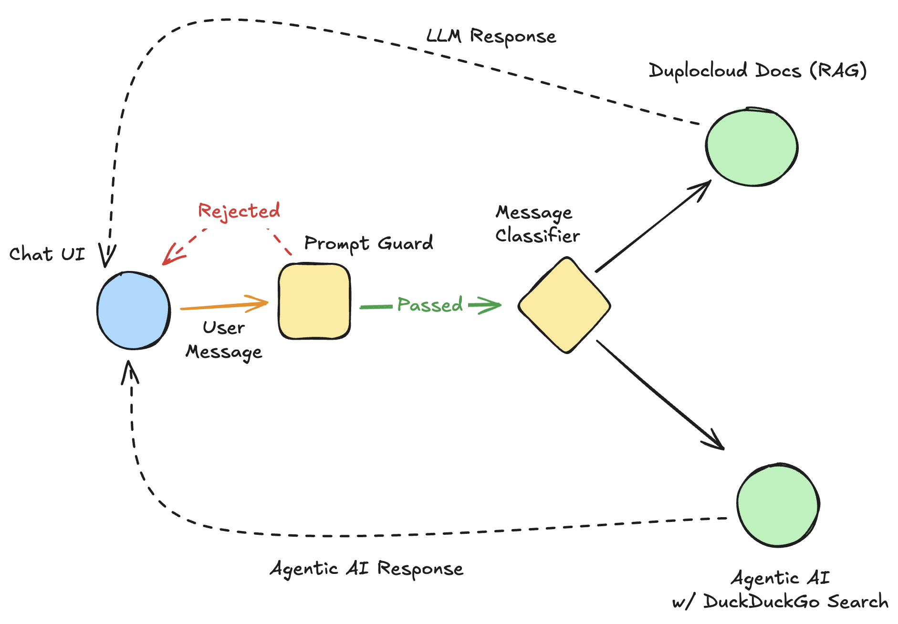
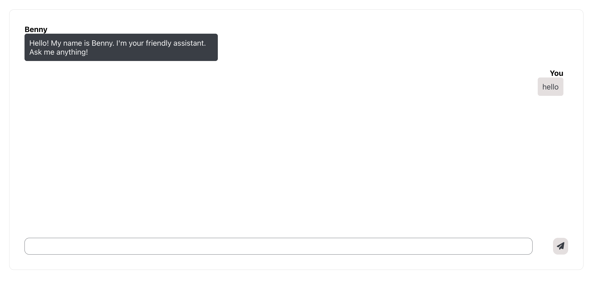

## Chat Message Flow



### Chat UI

This is a simple chatbot interface that I put together to demostrate the chatbot in action.



Please be patient, the systems is slow and sometimes errors. In a future verison, I need to add the chatbot thinking animation to give the user feedback.

### Prompt Guard

The prompt guard checks each user message for appropriate content. When the message is inappropriate, the message request is stopped and a message is sent to the user saying we are unable to answer your question, please try again.

#### Prompt

```text
Evaluate the prompt below and determine if it's professional and appropriate. Reject prompts that are not appropriate. Inappropriate prompts contain references to violent or illegal acts, sexual acts, profanity, racism, hate speech, war, terrorism, weaponry or any other content that is not appropriate for a professional setting. 
    
    Only respond with 1 if the prompt is appropriate and 0 if it is not appropriate. Respond with 0 if there is any doubt.
    
    Prompt: {message.message}
```


### Message Classifier

The Message Classifier evaluates each message and classifies it as either: 'duplocloud' or 'other.' When it's 'duplocloud', it routes it to the duplocloud docs RAG implementation. When it's 'other' the message is routed to the Agentic AI, where the LLM uses the DuckDuckGo Search Tool to find the answer.

#### Prompt

```text
Classify the following message into one of the following categories: 
        1. duplocloud
        2. other
        
        Any message that contains the word "duplocloud" or asks a question about CI/CD should be classified as "duplocloud". Else, it should be classified as "other". 
        
        Only answer with either "duplocloud" or "other".
        
        Message: {self.message.message}
```


### Duplocloud Docs RAG

This implementation uses [Chroma Db](https://python.langchain.com/docs/integrations/vectorstores/chroma/) as the vector database, and [Langchain](https://www.langchain.com/) to interact with Open AI.  


### Agentic AI with DuckDuckGo Search

The Agentic AI is built with [SmolAgent](https://huggingface.co/docs/smolagents/en/tutorials/tools) from HuggingFace and uses the DuckDuckGo Tool to search the internet.

## Connnecting to OpenAI API

In the root of the project is a `.env` file. Simply add an OpenAI API Key to the `OPENAI_API_KEY` key and you'll have access to open AI. See the `.env.example` file.

## Running Docker

After setting the `OPENAI_API_KEY` run the following commands to build and run the code in Docker

#### Build Image

```bash
docker build . -t duplocloud
```

#### Run Docker Image

```bash
docker run -d duplocloud
```

Navigate to http://127.0.0.1:8897 to view the chatbot interface.

## Running the Application Locally.

There are two steps to run the code locally:

First is to install and run uv. There is a requirements.txt file, so it can also be done using Python's native venv functionality. The application is built with Python 3.11. I've included the instrucitons to run the application with uv.

### Install uv  

Instructions to install uv from source can be found [here](https://docs.astral.sh/uv/).  
or  

```bash  
pip install uv
```

### Installing Python with uv  
```bash  
uv install python 3.11
```

### Creating Virtual Environment  
```bash  
uv venv --python 3.13
```

### Pin a Python Version  
```bash  
uv python pin 3.13
```

### Activating Virtual Environment  

```bash
source .venv/bin/activate
``` 
### Updating or Pulling Dependencies 

```bash  
uv sync
```

Second, we need to build the nodejs dependenices for the UI. I'm going to assume that nodejs is already installed, if not, it can be installed from the [nodejs](https://nodejs.org/en) web site.

### Installing dependencies
Navigate to `<application-root>/src/client` and run:

```bash
npm install
```

### Bundle the UI Packages
```bash
npm run build
```

### Run the application from the commandline.

Once those two commands are successfully ran, navigate to the `<application-root>`

```bash
python -m src.app --host 0.0.0.0 --port 8897 --allow_unsafe_werkzeug

```

## Add installing packages and information about running client.  
how od I integrate the client startup when starting Python server?  

## Architecture  

In general I followed Domain Driven Design(DDD)'s paradigm, with the following folder structure:

src/
├── client/
├── documents/
├── domain/
│   ├── models/
│   ├── repositories/
│   ├── services/
│   └── __init__.py
├── intents/
├── __init__.py
└── app.py

### client
This has all the client code, which is a very simple chatbot built with React and TypeScript using sockets for realtime communication.

### documents
This is a copy of the duplocloud documents found on the provide GitHub repository. The application loads and upserts the documents on each startup, but I don't pull new copies. I explored refreshing the documents on each start, put time was short and decided against that.

One of the challenges of RAG systems is keeping the Vector Store up to date with the latest changes.

As for the how the documents are chunked, I didn't do anything special, I'm just using what langchain-chromadb is doing by default. In previous projects we've tweaked the chunking and overlap. We've also explored using a Knowledge Graph as sometime concepts span the entire document, not just sections.

### domain
The root folder for the other DDD concepts.

### models
You'll find the ChatMessage model here, which does most of the commication heavy lifting between the server and the client.

### repositories
This is where the data access lives.

### services
This is where the llm code lives, you could argue that it belongs in the repositories folder because it access data and functionality outside the system...

### intents
This where all the Action and functionality for the ChatBot lives. Think of an intent as a pattern or workflow for a conversation to progress.

When the chatbot starts up, it starts with the "NewConversation" intent. This intent where the greeting you see lives. Once the NewConversation intent executes, there is a propoerty called "next_intent" and this contains the name of the next intent the user's input will be routed too. Currently, that's the "message_classifier". So the next user input will be routed to the MessageClassifierIntent. This one does the work as described in the above diagram. This intent routes the next user input to itself, this means the "next_intent" is set to "message_classifier."

### app.py
This is the entrypoint for the application. It has the Flask endpoints and is where the application starts.

## Agentic Agent Framework  
I'm using HuggingFaces's smolagent to run the Agentic AI and the internet searchs.

## Logging/Telemetry  
This application doesn't have any logging besides what langchain does out of the box. In a production application, we'll want logging and telementry (times to execute services, other meaningful data to determine the health of the application). What telementry brings us is the ablity to know when an application is performing poorly. Logging alone doesn't do that for us.
  
## User Authentication  
No user Authentication or Authorization. Of course, any system will need it. Ideally it's not home grown and we use something that is battle tested.

## Rest API
I wasn't able to implement the RestAPI. However, if I did, I was planning to use Blueprint for the swaggar documentation. JWT would be used for the authentication. I initially was planning to expose intents as endpoints, however, I forgot that sockets work a bit differently than REST Endpoints. I would have needed to refactor the code seperate the sockets from the functionality, and I didn't have the time to do that. 

## Testing
There isn't any testing in the application, ideally, we'd have tests around the logic and calulations (when there are calculations).

## Questions

If there are any questions, please follow up with me.

## Not Implemented

Unfornately, I ran out of time to add more code level documentation and to implement the RestAPI and the Swagger Docs.